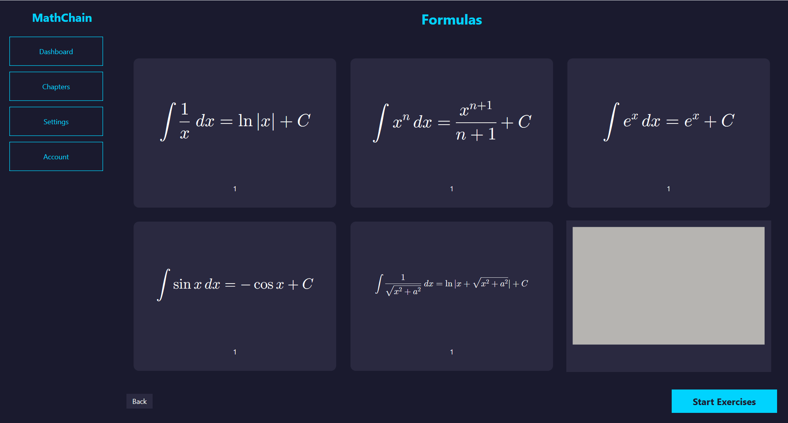

#  MathChain


##  Overview
Mathchain is a Web3 Software as a Service educational platform, its purpose is to have a better understanding about mathematical problems in domains such as calculus, algebra, geometry, artificial intelligence, etc. The approach of learning formulas consists of transforming classic 2D formulas into interactive 3D formulas. Each learning chapter concludes with an evaluation system, using the Wolfram Alpha API to generate mathematical problems.

##  Key Features
- Interaction with 3D models.
- Generating and validating math problems.
- A Solidity Smart Contract deployed on Ethereum Sepolia testnet for payments to unlock step-by-step solutions.
- Decentralized authentication via Metamask/Phantom wallet.

## Preview

### Video - WPF

<div>

</div>

> [!NOTE]  
>  The WPF project will be removed soon.

### Video - Blazor

<div>

</div>

> [!NOTE]  
>  All formulas are rendered in Blender.

## Tech Stack

### Frontend
- **Blazor WebAssembly** — web interface
- **MudBlazor** — UI component library
- **Three.js** — 3D model rendering in browser
- **KaTeX** — LaTeX formula rendering
- **WPF + Helix Toolkit** — desktop prototype with 3D rendering
- **WpfMath** — LaTeX formula rendering (WPF)
- **JavaScript Interop** — wallet integration


### Backend
- **ASP.NET Core Web API** — REST API architecture
- **Wolfram Alpha API** — mathematical validation
- **xUnit** — unit testing framework
- **C# / .NET 8**

### Blockchain and Web3
- **Solidity** — smart contract language
- **Remix IDE** — contract development and deployment
- **Ethereum Sepolia Testnet** — blockchain network
- **Nethereum** — C# Web3 integration
- **WalletConnect v2** — wallet connectivity

> [!NOTE]  
>  Mathchain was initially developed as a desktop application using WPF. However, realizing that an educational application like this is much better suited for the browser, the project is currently moving to **Blazor WebAssembly**. The original WPF prototype will remain available in the repository until the Blazor version reaches the same level.

## Architecture
 A hybrid architecture is used to maximize efficiency 
and minimize gas fees:

1. **Off-Chain Validation**: Mathematical validation is handled 
   by Wolfram Alpha..
2. **On-Chain SaaS Logic**: Premium content unlocking is handled 
   by a Smart Contract.
3. **Decentralized Identity**: User identity is established through 
   MetaMask/Phantom wallet signatures.

## Prerequisites
- **Visual Studio 2022** or above installed.
- **.NET 8 SDK** installed.
- **MetaMask/Phantom** browser extension installed and a wallet funded with **Sepolia Test ETH**.
- A **Wolfram Alpha Developer AppID**.
- An **Infura** or **Alchemy** RPC URL for the Sepolia Testnet.
- A **WalletConnect Cloud Project ID**.
- A `.env` file located in the root of the WPF project containing the following variables:
  ```env
  CONTRACT_ADDRESS=your_contract_address
  INFURA_RPC_URL=your_rpc_url
  WOLFRAM_API_KEY=your_wolfram_api_key
  PROJECT_ID=your_walletconnect_project_id
  
## Setup
1. Clone the repository.
2. Create `.env` file with required variables.
3. Set Multiple Startup Projects: API + Blazor.
4. Run the solution.

## What's next?
- Wolfram Alpha integration in Blazor.
- Delete WPF project.
- Implement Dashboard, Account and Settings pages in Blazor project.
- Bring more formulas from Blender.
- Add a scientific calculator for exercise page.
  
## Licence
* This project is licensed under the MIT License.
